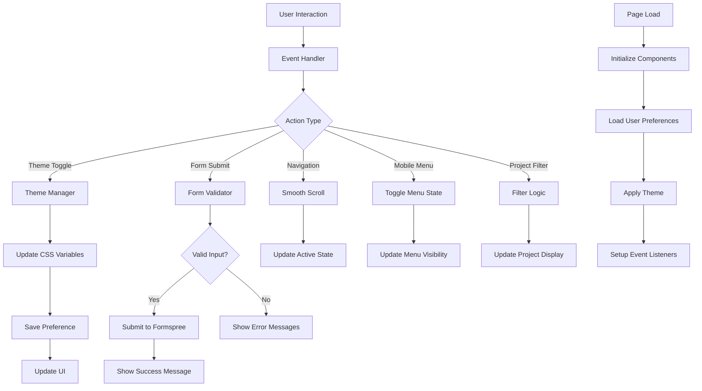

# Personal Portfolio Website - System Architecture

## Frontend Architecture

### Component Structure
```
Portfolio Website
├── Header Component
│   ├── Logo/Brand
│   ├── Navigation Menu
│   │   ├── Home
│   │   ├── Experience
│   │   ├── Projects
│   │   ├── About
│   │   └── Contact
│   ├── Theme Toggle (Dark/Light)
│   └── Mobile Menu Button
│
├── Main Content Area
│   ├── Hero Section
│   │   ├── Professional Headshot
│   │   ├── Bio Summary
│   │   ├── Key Skills Highlight
│   │   └── CTA Buttons
│   │
│   ├── Experience Timeline
│   │   ├── Timeline Container
│   │   ├── Experience Cards
│   │   │   ├── Company Logo
│   │   │   ├── Role Title
│   │   │   ├── Duration
│   │   │   ├── Key Achievements
│   │   │   └── Technologies Used
│   │   └── Education Milestone
│   │
│   ├── Projects Portfolio
│   │   ├── Projects Grid
│   │   ├── Project Cards
│   │   │   ├── Project Image
│   │   │   ├── Title & Description
│   │   │   ├── Impact Metrics
│   │   │   ├── Tech Stack
│   │   │   └── Links (Demo, Code)
│   │   └── Filter/Sort Options
│   │
│   ├── Skills Section
│   │   ├── Technical Skills
│   │   ├── Certifications
│   │   └── Tools & Technologies
│   │
│   ├── About Section
│   │   ├── Professional Journey
│   │   ├── Personal Interests
│   │   └── Values & Philosophy
│   │
│   └── Contact Section
│       ├── Contact Form
│       ├── Contact Information
│       └── Social Media Links
│
└── Footer Component
    ├── Copyright Information
    ├── Quick Links
    └── Back to Top Button
```

### Data Flow Architecture



### File Structure
```
├── index.html                 # Main HTML structure
├── src/
│   ├── css/
│   │   ├── input.css         # Tailwind source with custom styles
│   │   └── output.css        # Generated CSS (git-ignored)
│   ├── js/
│   │   ├── main.js           # Core application logic
│   │   ├── theme.js          # Dark/light mode functionality
│   │   ├── forms.js          # Form validation and submission
│   │   ├── navigation.js     # Smooth scrolling and menu
│   │   └── animations.js     # Intersection Observer, animations
│   ├── images/
│   │   ├── hero/
│   │   ├── projects/
│   │   └── icons/
│   └── data/
│       ├── experience.json   # Career timeline data
│       ├── projects.json     # Portfolio projects
│       └── skills.json       # Technical skills
├── docs/                     # Documentation
└── config/
    └── tailwind.config.js    # Tailwind configuration
```

## Component Specifications

### Header Component
- **Sticky Navigation**: Fixed position on scroll
- **Responsive Menu**: Hamburger menu for mobile
- **Active States**: Highlight current section
- **Theme Toggle**: Smooth transition between modes
- **Accessibility**: Keyboard navigation, ARIA labels

### Hero Section
- **Responsive Layout**: Stack on mobile, side-by-side on desktop
- **Professional Image**: Optimized WebP format with fallback
- **Animated Text**: Typewriter effect for role titles
- **CTA Buttons**: Primary and secondary actions
- **Social Proof**: Key metrics or certifications

### Experience Timeline
- **Vertical Timeline**: Mobile-first design
- **Interactive Cards**: Expandable details on click/tap
- **Progress Indicators**: Visual timeline progression
- **Responsive Layout**: Alternate sides on desktop
- **Data-Driven**: JSON configuration for easy updates

### Projects Portfolio
- **Grid Layout**: CSS Grid with responsive columns
- **Image Optimization**: Lazy loading, WebP format
- **Filter System**: Category-based filtering
- **Modal Details**: Expanded project information
- **Performance**: Intersection Observer for animations

### Contact Form
- **Real-time Validation**: Immediate feedback
- **Accessibility**: Proper labels, error announcements
- **Security**: Input sanitization, rate limiting
- **Success States**: Clear confirmation messaging
- **Progressive Enhancement**: Works without JavaScript

## State Management

### Theme State
```javascript
const themeState = {
  current: 'light', // 'light' | 'dark'
  preference: 'system', // 'light' | 'dark' | 'system'
  systemPreference: 'light'
};
```

### Navigation State
```javascript
const navigationState = {
  activeSection: 'hero',
  mobileMenuOpen: false,
  scrollPosition: 0
};
```

### Form State
```javascript
const formState = {
  isSubmitting: false,
  errors: {},
  success: false,
  data: {
    name: '',
    email: '',
    message: ''
  }
};
```

## Performance Architecture

### Loading Strategy
1. **Critical CSS**: Inline above-the-fold styles
2. **Progressive Enhancement**: Core functionality without JS
3. **Lazy Loading**: Images and non-critical components
4. **Resource Hints**: Preload key assets
5. **Service Worker**: Cache static assets (future enhancement)

### Optimization Techniques
- **Image Optimization**: WebP with JPEG fallback
- **CSS Purging**: Remove unused Tailwind classes
- **JavaScript Minification**: Compress production code
- **CDN Delivery**: Static asset optimization
- **Gzip Compression**: Server-level compression

## Security Architecture

### Input Validation
- **Client-side**: Immediate user feedback
- **Server-side**: Formspree handles backend validation
- **Sanitization**: Prevent XSS attacks
- **Rate Limiting**: Prevent form spam

### Content Security Policy
```
Content-Security-Policy: 
  default-src 'self';
  style-src 'self' 'unsafe-inline' https://fonts.googleapis.com;
  font-src 'self' https://fonts.gstatic.com;
  img-src 'self' data: https:;
  script-src 'self';
  form-action 'self' https://formspree.io;
```

### Security Headers
- **HTTPS Only**: Force SSL/TLS encryption
- **HSTS**: HTTP Strict Transport Security
- **X-Frame-Options**: Prevent clickjacking
- **X-Content-Type-Options**: Prevent MIME sniffing

## Accessibility Architecture

### Semantic Structure
- **HTML5 Elements**: nav, main, section, article, aside
- **Heading Hierarchy**: Logical h1-h6 structure
- **Landmark Roles**: Navigation, main, complementary
- **Skip Links**: Jump to main content

### Interactive Elements
- **Keyboard Navigation**: Tab order, focus management
- **Screen Reader Support**: ARIA labels, descriptions
- **Color Independence**: Not relying solely on color
- **Touch Targets**: Minimum 44px × 44px

### Testing Strategy
- **Automated Testing**: axe-core integration
- **Manual Testing**: Screen reader testing
- **User Testing**: Accessibility user feedback
- **Compliance**: WCAG 2.1 AA standards

## Deployment Architecture

### Build Pipeline
1. **Source Control**: Git with GitHub
2. **Pre-build**: CSS purging, JS minification
3. **Build**: Generate optimized assets
4. **Test**: Lighthouse audit, accessibility check
5. **Local Testing**: Manual testing across browsers

### Development Strategy
- **Local Development**: Live server with hot reloading
- **Version Control**: Git with GitHub
- **Forms**: Formspree integration for local testing

This architecture ensures a scalable, maintainable, and performant portfolio website that meets all requirements while providing an excellent user experience across all devices and accessibility needs.
